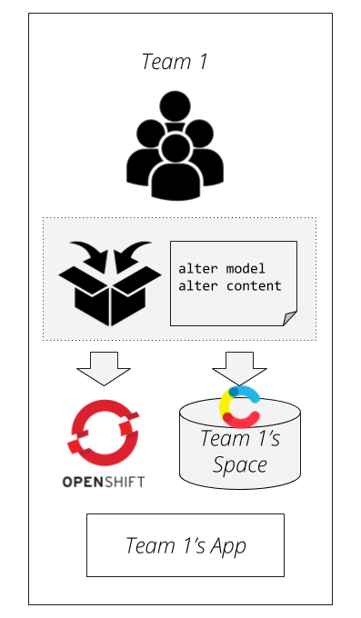
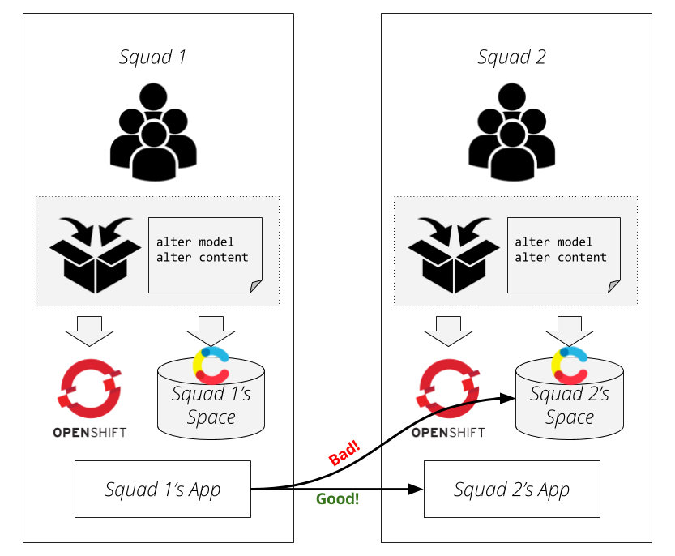
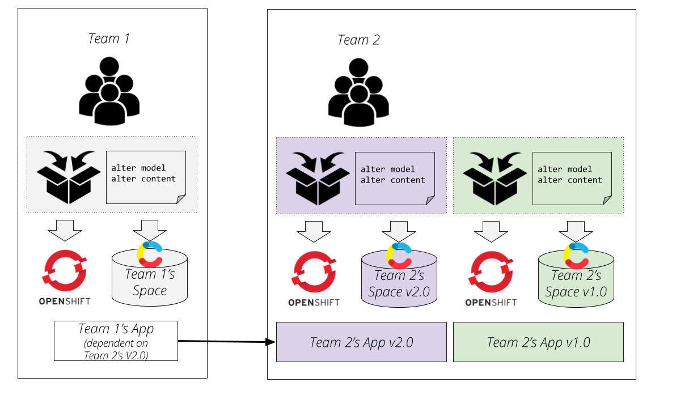

# CMS as Code

## Why

The way that software development teams interact with CMS systems today is undergoing a change. The old paradigms of using a CMS to build an app have serious challenges - as a general rule, they aren't compatible with modern techniques like Continuous Delivery - changes made to the content and content model must generally be made manually.

Applications which embed a custom CMS implementation can sidestep these problems; they can have direct control of the DB, so they can just use what a Rails developer might call ["migration scripts"](http://guides.rubyonrails.org/active_record_migrations.html) [1](#dbdeploy) or a .NET dev might call ["code first migration"](https://weblogs.asp.net/scottgu/using-ef-code-first-with-an-existing-database). They can use these concepts to script changes to the underlying schema that dictates the content model, and even the content itself. They can write database scripts which safely change whatever content is in the prod db, and test these scripts in dev, test, staging, even pre-publish environments. This gives them quite a bit of safety around the process. 

Headless CMS systems like Contentful promise to be somewhere in between - a bit of a toolkit that we can use to build the CMS that we might want. Today, Contentful offers us many capabilities; to [extend their UI](https://www.contentful.com/developers/docs/concepts/uiextensions/), a powerful API that can do most of what the UI does, and the flexibility to model content as we like. We can even use the [API](https://www.contentful.com/developers/docs/references/content-management-api/) to alter the content model and content itself. However, the lack of a tool to support content transformation leaves us in a state where we don't quite have the benefits that our friends who embed their own CMS have. We can't apply the ["database evolution"](https://martinfowler.com/articles/evodb.html) concept to safely, programmatically alter content model and content itself.

So why do we care?

We're incredibly close to having a CMS system that's vendor supported, that we don't have to own the maintenance or operation of, that properly supports modern Continuous Delivery practices around safe code changes.

Let's finish the job.

## What

Our Hypothesis:

"For teams that are focused on building apps where a headless CMS like Contentful is a major part of their architecture, the combination of a compatible content management API, a *DSL* focused on changing content/content models, and a *migration runner* tool could be used together to safely, incrementally, programatically, change content and models in Contentful by running *migration scripts* that devs would write."

The pieces we might need:
 - Management API extensions that enable content change (provided by Contentful)
 - An idea of what the DSL might look like. For instance, the Rails [Active Record DSL](http://edgeguides.rubyonrails.org/active_record_migrations.html) for content migration is one approach, but wouldn't fit what we'd need for content.
 - An idea of what the migration runner tool might look like. Perhaps something like [DBDeploy](http://dbdeploy.com/)
 - Documentation and guidelines around how the DSL and tools should be used, specifically covering the engineering discipline needed to ensure that squads building apps test those apps against not only the "vcurrent" version of the content schema which is in prod today, but also the "vnext" version of the schema that will be published next

## How

 - Following the principle that ["Integration databases are an antipattern"](https://martinfowler.com/bliki/IntegrationDatabase.html), we believe that each squad or close collection of squads within an outcome team ought to own a space. 
 - The squad that owns the space can own the development, testing, and deployment of the database migration scripts that evolve that content space
 - If you follow the db migration analogy, these scripts would be doing not only the content model (analagous to "alter table") commands, but also the commands that would re-shape the existing content itself 

 - When other squads need content that a fellow squad makes, it's best to integrate via a service (like Global Header does today) not by integrating with the other squad's content space
 - Such "global content spaces" might be owned by squads that publish services that expose the content that others can share
 - It would generally be considered good practice to use one another's content by connecting to one another's services, not connecting directly to another team's content model - as this would be analogous to the Integration Database anti pattern again.

 

### Versioning

 - If a squad that provides a piece of content that was shared with many teams wants to change the schema on this content, it may end up impacting many teams, as the teams who leverage the content may have developed components that make assumptions about the content model in question
 - In order not to break the constraint around teams connecting directly to one another's content repositories, one suggestion would be for the team that creates the global item to maintain two separate versions of that item - the new and improved one, and the old one that existing teams have already taken a dependency against. This allows the dependent teams to schedule the work at their leisure

 

## References

<a name="#dbdeploy">1</a> Systems like [DBDeploy](http://dbdeploy.com/) make this capability available generically to several languages and database systems, SQL and NoSQL alike.
 
[Martin Fowler's article](https://martinfowler.com/articles/evodb.html) on the concept of database evolution, which includes the migrations concept

More on [applications which embed](https://martinfowler.com/articles/two-stack-cms/) their own custom CMS implementation

Dmytri Kleiner's article on [CMS as Code](https://www.contentful.com/r/knowledgebase/cms-as-code/)  which coined the phrase
