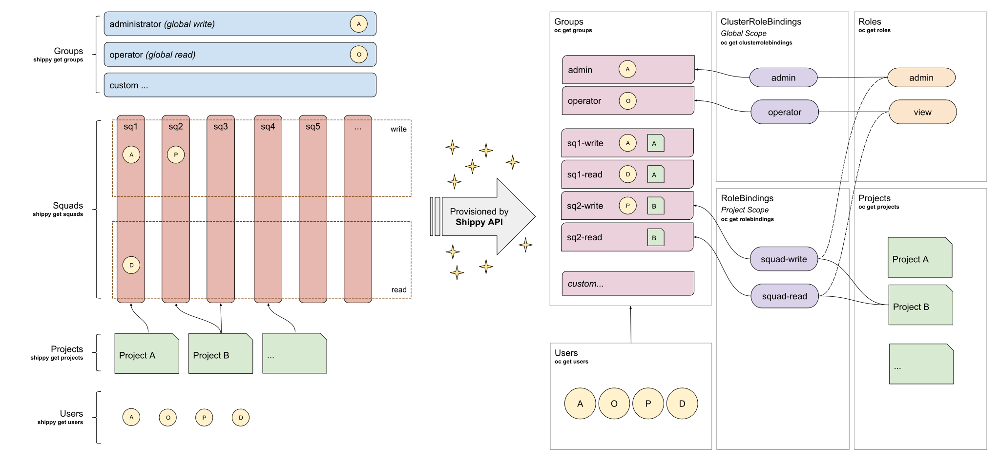
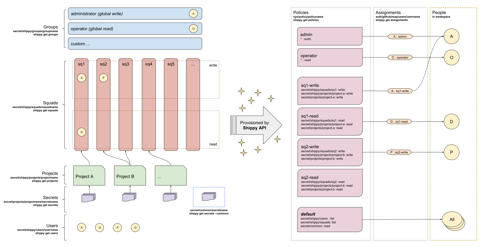

  # Shippy

## Why

We want a common tool to access our delivery infrastructure and development environments.

## What

The indefatigable TELUS digital delivery platform assistant.

-   Clone and deploy [reference architecture](https://github.com/telusdigital/reference-architecture) starter kits
-   Onboard users into OpenShift & HashiCorp Vault
-   Create squads & assign tech leads & members
-   Create projects & assign them to squads
-   Toggle between environments & projects
-   Edit Vault secrets & policies
-   Bonanza of memes & laffs

## How

### Shippy OpenShift Policy

### Shippy Vault Policy

Shippy core values:

### Safety

-   Ensure our customer experience is great
-   Automate operational compliance: test, content, API, delivery, design, arch, analytics, TDIM, release mgmt
-   Tests: unit, integration, e2e, (opt: contract, device)
-   Code Standards: follows reference architecture
-   Practices: e.g. TDD, CI/CD, etc.
-   Tools: Slack, Jira, GitHub, OpenShift, Jenkins, Kibana, NewRelic, PagerDuty, Swagger, Elasticache, multi-az RDS, HashiCorp Vault

### Security

-   Increase code quality / standards
-   Keeping the baddies out of things
-   Keeping us out of the news
-   Automated testing during build
-   Continuous testing after build

### Speed

-   Applications are performant
-   Outcome teams are empowered to be data-driven
-   Outcome teams are able to get ideas out to customers quickly
-   Use starter kit templates to give teams quick, safe, boilerplate projects
-   Build pipeline executes in the shortest amount of time possible
-   Incidents can be responded to quickly and efficiently

## Who

@delivery

## References

-   [shippy-cli](https://github.com/telusdigital/shippy-cli)
-   [@telusdigital/shippy-cli](https://www.npmjs.com/package/@telusdigital/shippy-cli)
