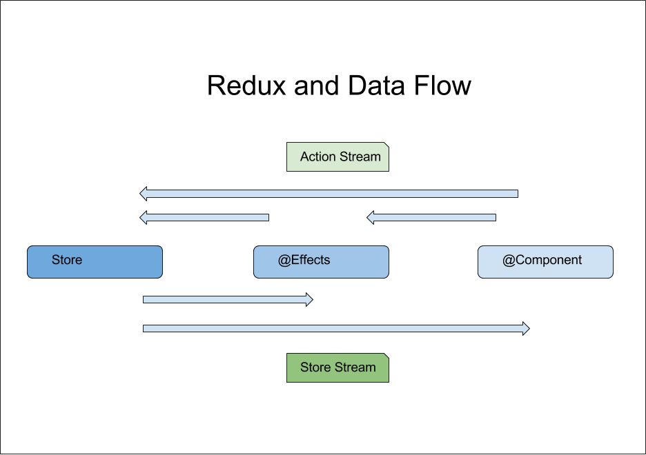

# Redux

## Why

While [React.js](react.md) gives us stateful components, we need another
[isomorphic](isomorphic.md) tool to manage state across our entire
single-page-applications. More specifically we need a
[Single Source of Truth](https://en.wikipedia.org/wiki/Single_source_of_truth).
Managing state in a declarative framework like React is critical, and easy to
get wrong. How can we minimize side effects, while maximizing testability and
reproducibility? We separate data, logic, and rendering. How can we visualize
the changes we are pushing to our state?
[Uni-directional data flow](http://redux.js.org/docs/basics/DataFlow.html)
makes it easy to reason about the interractions between actors.

## What

[Redux](http://redux.js.org/) is a tiny (2kb) library used most commonly with
React single-page-applications, to manage its state. It has an excellent
[browser dev tool](https://github.com/gaearon/redux-devtools) that shows you
the actions you make, and the state mutations that are caused by them.

Redux uses a single source of truth, called "the store", which is an immutable
object tree. The only way to change the data is by emitting "actions", which
describe what you want to do. These actions use "reducers" to perform the
mutations to the state. All of these concepts are rooted in functional
programming, and therefore highly unit testable.

| Function                          | React With `react-redux` | Server              |
| --------------------------------- | ------------------------ | ------------------- |
| Presentation View                 | `React Components`       | Client API          |
| Communication                     | `Action`                 | Function Invocation |
| Logic to massage data for Storage | `Saga`                   | Services            |
| Data Storage                      | `Store`                  | Database            |

## How

Our
[TELUS isomorphic starter kit](https://github.com/telus/telus-isomorphic-starter-kit)
defines our standard UI application, with React and Redux at its heart. The
[FAQ](https://github.com/telus/telus-isomorphic-starter-kit/tree/master/ui#faq)
has a lot of information about how we use Redux.

### React Component

1. Responsible for Presentation and User Interractions.
2. It is blind to the complexities of the app (Doesn't know what happens after action is broadcasted).
3. React to state change via `connect`.

### Actions

1. Responsible for Communication between parts of redux
2. Use event descrption instead of function Invocation
3. Listeners are responsible to determine how to react to actions

### Reactive Style

1. Describe an event via Actions-
2. Actions describes a need as a fact or an event already happened without dictating how to fulfill the need.
3. Eg. Need => `TIME_TO_TRAVEL_ARRIVED`
  - `personOneSaga` reacts by => `startWalking()`
  - `personTwoSaga` reacts by => `callTaxi()`

### Store

1. Responsible for application state (immutability, persisting to disk, etc).
2. The [Single Source of Truth](https://en.wikipedia.org/wiki/Single_source_of_truth).
3. Keeper of state information, should not keep business logic.
4. Can only be affected by actions.
5. Prevent unintentional modifications by other methods via Object Reference, or Directly Accessing Store Members.

```ts
//Reducer
export const people = (state = [], action) => {
  switch (action.type) {
    case 'PERSON_REMOVED':
      return state.filter(person => person.id !== action.payload);
    default:
      return state;
  }
};
```

### The Saga Library

1. Responsible for Business Logic and Async actions (HTTP Calls).
2. Does not keep local state.
3. Typical use is take user input, make an HTTP call, and provide output to go into the store.

### Redux Dataflow



## Who

Front-end developers

## References

- [Redux](http://redux.js.org/)
- [Getting started with Redux](https://egghead.io/courses/getting-started-with-redux)
- [Redux Devtools](https://github.com/gaearon/redux-devtools)
