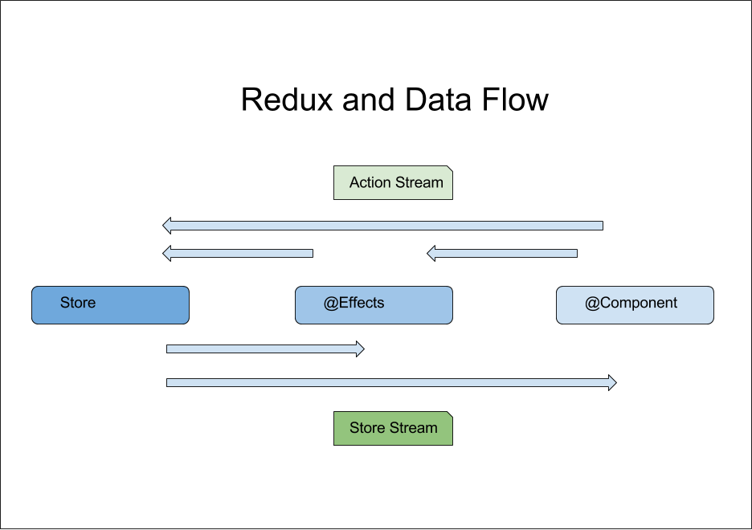

# Redux (react-redux)

---

## Why - Motivation

1. Create [Single Source of Truth](https://en.wikipedia.org/wiki/Single_source_of_truth)
1. [Separation of Concern](https://en.wikipedia.org/wiki/Separation_of_concerns) : Separation of Data, Logic, and Rendering
1. Improve scalability by having things [_react_ to events](https://hackernoon.com/dispatch-redux-actions-as-events-not-commands-4de8a92b1ea5) as opposed to caller dictating actions
1. Reduce Complexity of Mental Map by promoting separation of responsibility
1. Create a coherent framework so future developers will know how to add features by following convention
1. [Uni-Directional Data Flow](http://redux.js.org/docs/basics/DataFlow.html) : Easy to reason about the interractions between actors

---

# What - Structure of Systems - Redux vs Server Architecture

| Function                          | React With `react-redux` | Server              |
| --------------------------------- | ------------------------ | ------------------- |
| Presentation View                 | `React Components`       | Client API          |
| Communication                     | `Action`                 | Function Invocation |
| Logic to massage data for Storage | `Saga`                   | Services            |
| Data Storage                      | `Store`                  | Database            |

---

# How

## `React Component`

1. Responsible for Presentation and User Interractions
1. It is blind to the complexities of the app (Doesn't know what happens after action is broadcasted)
1. React to state change via `connect`

---

## Actions

1. Responsible for Communication between parts of redux
1. Use event descrption instead of function Invocation
1. Listeners are responsible to determine how to react to actions

### `Reactive Style`

1. Describe an event via Actions
1. Actions describes a need as a fact or an event already happened without dictating how to fulfill the need.
1. Eg. Need => `TIME_TO_TRAVEL_ARRIVED`
   1. `personOneSaga` reacts by => `startWalking()`
   1. `personTwoSaga` reacts by => `callTaxi()`

---

## Store

1. Responsible for application state (Immutability, Persisting to Disk etc.)
1. The [Single Source of Truth](https://en.wikipedia.org/wiki/Single_source_of_truth)
1. Keeper of state information, should not keep business logic
1. Can only be affected by actions
1. Prevent unintentional modifications by other methods via Object Reference, or Directly Accessing Store Members

---

```ts
//Reducer
export const people = (state = [], action) => {
  switch (action.type) {
    case 'PERSON_REMOVED':
      return state.filter(person => person.id !== action.payload);
    default:
      return state;
  }
};
```

---

## The Saga Library

1. Responsible for Business Logic and Async actions (Http Calls)
1. Does not keep local state
1. Typical use is take user input, make http call, and provide output to go into store

---

## Redux Dataflow



---

# Who

Frontend Developers
