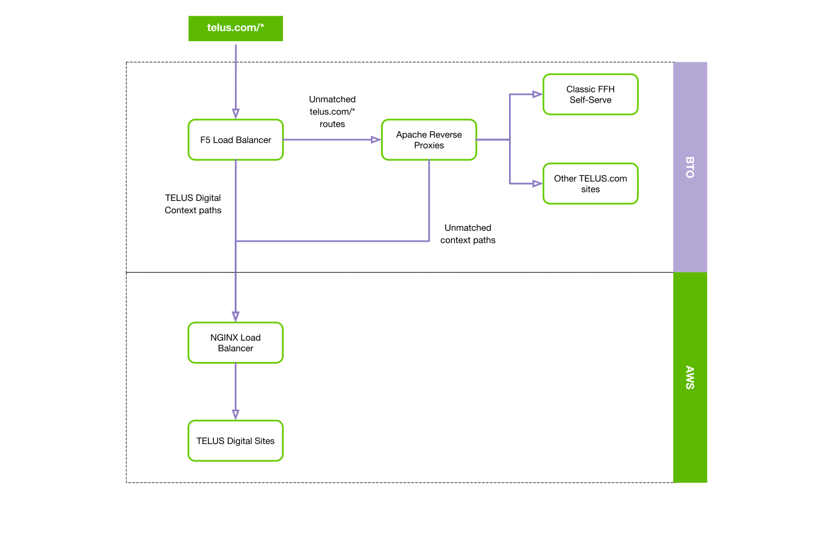

# URI Structure

## Why

TELUS digital does not fully control www.telus.com domain.  www.telus.com currently resolves to an F5 load balancer appliance that is owned by BTO.  We have specific context [paths][f5-www.telus.com] we route to [inbound proxies](../delivery/inbound-proxies/.md) that TELUS digital maintains.

We've been routing various paths in our inbound proxies to our applications deployed on AWS / OpenShift without any guidelines and conventions.

The purpose of this document is to drive consistency for structuring our urls and describe how traffic gets routed to our applications on www.telus.com.

## What

Every HTTP URL conforms to the syntax of a generic URI.

`scheme:[//[user[:password]@]host[:port]][/locale][/path][?query][#fragment]`

This document will be concerned with `[/locale][/path][?query]` when routing from our TELUS inbound proxies to applications on AWS / OpenShift.

## How

What belongs in `[/locale][/path]` portion of URI?

### Routing

Once specific context paths are created in BTO F5 to route to TELUS digital inbound proxies, from there we have control to route to our different applications. This diagram describes the routing for a telus.com request:

### Locale

The `[/locale]` segment describes what locale the content is intended for. The locale can contain the language and region.  Language is mandatory, and region is optional.  Example URLs:

- `www.telus.com/en/bc/internet`
- `www.telus.com/en/business`

The desired behaviour on the Reference Architecture is for applications to set the locale through the `[/locale]` URL segments.  Do **not use cookies** to set the locale.

Historically, the `[/locale]` was set through cookies on the Java & PHP stack.  The cookies would overwrite the locale that is provided through the URL.  

#### Available Locales

Currently, only `en` and `fr` are supported by the [F5 routing][f5-www.telus.com].

For the regions, the following URI segments are supported: 

| Region | Region URI Segment |
| :---: | :---: |
| British Columbia | `bc` |
| Alberta | `ab` |
| Manitoba | `mb` |
| New Brunswick | `nb` |
| Newfoundland | `nl` |
| Northwest Territories | `nt` |
| Nova Scotia | `ns` |
| Nunavut | `nu` |
| Ontario | `on` |
| Prince Edward Island | `pe` |
| Quebec | `qc` |
| Saskatchewan | `sk` |
| Yukon | `yt` |

### Routing for www.wcstage.telus.com

We first test such routes on www.wcstage.telus.com and the configurations are maintained in the inbound.telus-gateway-staging-config [repository][telus-gateway-staging-config].

### Routing for www.telus.com

Once we have tested our rotes on www.wcstage.telus.com we can then update configurations for production.  The configurations for production are maintained in the inbound.telus-gateway-production-config [repository][telus-gateway-production-config]

### Selecting Specific Resources

- eg. `my-account/transactions/account/:ban/subscriber/:sub`

What belongs in `[?query]` portion of URI?

- Used once resources have been selected and we want to filter/sort them

## Who

Any teams deploying to www.telus.com:
- Home Marketing
- Mobility Marketing
- My Account
- Business

## References

- [F5 Context Paths to AWS for www.telus.com][f5-www.telus.com]
- [RFC 6570][rfc-6570]
- [Inbound proxies](../delivery/inbound-proxies/.md)
- [inbound.telus-gateway-staging-config][telus-gateway-staging-config]
- [inbound.telus-gateway-production-config][telus-gateway-production-config]

[f5-www.telus.com]: http://www.teluswebteam.com/wiki/doku.php?id=f5_context "F5 Context Paths to AWS for www.telus.com"
[rfc-6570]: https://tools.ietf.org/html/rfc6570 "RFC 6570"
[telus-gateway-staging-config]: https://github.com/telusdigital/inbound.telus-gateway-staging-config "inbound.telus-gateway-staging-config"
[telus-gateway-production-config]: https://github.com/telusdigital/inbound.telus-gateway-production-config "inbound.telus-gateway-production-config"
