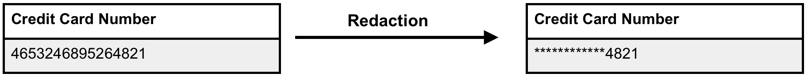
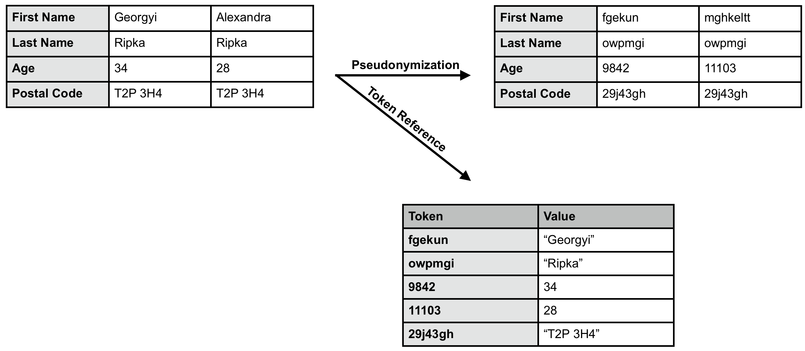
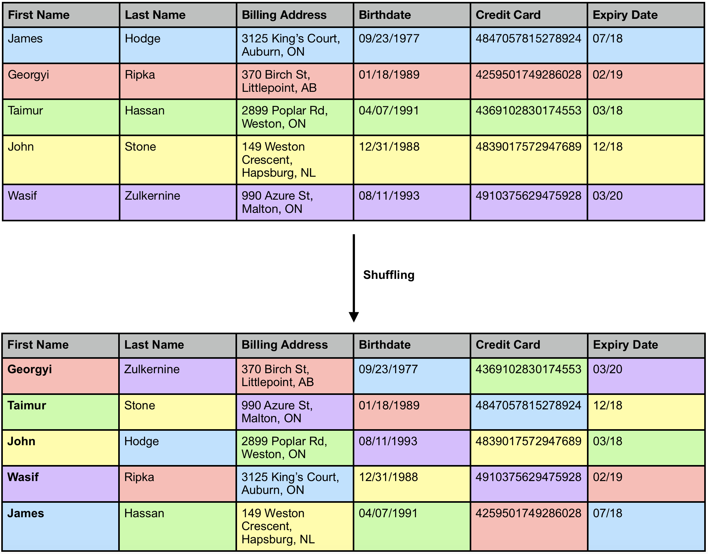
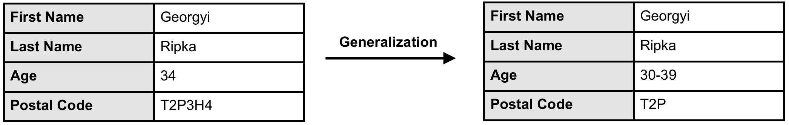
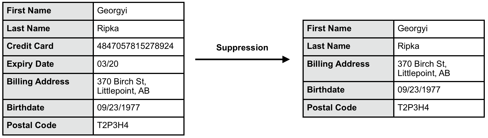
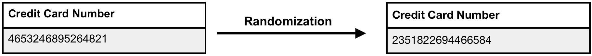
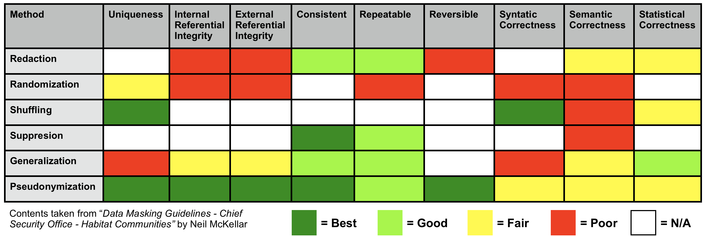

# Why

TELUS has had a long standing commitment to putting customers first, and part of putting customers first is protecting their privacy. In this age of information and constant connectivity, there is more data available than ever, and customers expect their data to be used responsibly and their personal information protected persistently. TELUS has a strong commitment to going above and beyond these expectations.

  

At TELUS Digital we strive to improve the customer experience through the use of the Digital Platform. In our efforts to improve each and every customer’s experience, we utilize consumer data to provide insights into how we can help improve our platform and services to make customers’ lives easier. In the data that we use there is often sensitive information that can be personally identifiable. This sensitive information, although useful to our goal of improving customer experience, can pose a privacy risk if this sensitive information is connected to an individual. One of the hurdles at TELUS Digital is how we can de-identify these datasets to protect privacy while still preserving its utility and referential integrity.

# What

This documentation outlines the different methods available to the creators at TELUS Digital to de-identify their data while maintaining a harmonious relationship between privacy and utility.

# How

## Redaction

Redaction is the process of partially masking-out fields deemed sensitive or identifying. A common example of redaction is a credit card number masked with asterisks. This method can reduce the referential integrity of data as syntactic correctness is lost and statistical correctness is reduced. Redaction is not reversible unless a mapping to the original data has been made. Redaction is often used when the values are not needed downstream.

 

| Attribute | Rating | Explanation                                                       |
|:---------:|:------:|-------------------------------------------------------------------|
|  Secrecy  |  **GOOD**  | Reasonable protection of sensitive information.                   |
|  Privacy  |  **FAIR**  | Still allows for correlation of transactions with the individual. |
|  Utility  |  **FAIR**  | Allows significant secondary production uses                      |

[Contents of table taken from “_Data Masking Guidelines - Chief Security Office - Habitat Communities”_ by Neil McKellar]

 

## Pseudonymization/Substitution

Pseudonymization or Substitution is the process of replacing identifying data with alternative values (often partially randomized), these values can be tokenized so that the pseudonymized data can be linked back to the original dataset. This method provides a good degree of protection as, unlike with encryption, no information is stored in the pseudonymized values themselves. Pseudonymization preserves a favourable amount of utility as the correlations between values are maintained.

 

| Attribute | Rating | Explanation                                                       |
|:---------:|:------:|-------------------------------------------------------------------|
|  Secrecy  |  **GOOD**  | Obscures sensitive data elements.                    |
|  Privacy  |  **POOR**  | By preserving consistency, correlation of the substituted value still allows tracking of the individual. |
|  Utility  |  **FAIR**  | It preserves referential integrity and can be used to preserve syntactic and semantic correctness.                      |

[Contents of table taken from “_Data Masking Guidelines - Chief Security Office - Habitat Communities”_ by Neil McKellar]

 

## Shuffling
Shuffling is the process of moving elements around in a dataset. This breaks the correlations between individuals and their identifying data, however, the sensitive data is still contained in the set. Shuffling allows for the analysis of statistical distribution but the correlation between fields is lost.

 

| Attribute | Rating | Explanation                                                       |
|:---------:|:------:|-------------------------------------------------------------------|
|  Secrecy  |  **POOR**  | Sensitive data elements are still present, although context is obscured                   |
|  Privacy  |  **FAIR**  | Obscures the context for sensitive data |
|  Utility  |  **FAIR**  | Syntactic correctness can be maintained. Statistical correctness may be maintained. Semantic correctness is hard to maintain.                      |

[Contents of table taken from “_Data Masking Guidelines - Chief Security Office - Habitat Communities”_ by Neil McKellar]

 

## Generalization

Generalization is the process replacing exact values with value ranges to preserve privacy. For example, it may not be necessary to know an individual's exact birthday but rather they are in their 50s. This can only be done to certain types of data; fields like gender, names, and credit card information cannot be generalized.

 

| Attribute | Rating | Explanation                                                       |
|:---------:|:------:|-------------------------------------------------------------------|
|  Secrecy  |  **POOR**  | This method often leaves sensitive data present while generalizing data elements that correlate with it.                   |
|  Privacy  |  **FAIR**  | Properly done, privacy can be preserved, but many approaches have proven to be weak or poorly thought out. |
|  Utility  |  **GOOD**  | Preserves many of the functional requirements.                      |

[Contents of table taken from “_Data Masking Guidelines - Chief Security Office - Habitat Communities”_ by Neil McKellar]

 

## Suppression

Suppression is the complete removal of sensitive fields. No place holders are used and there is no evidence of the original values. Suppression has strong negative impacts impacts on the utility of a dataset but is an effective way of eliminating PII.

 

| Attribute | Rating | Explanation                                                       |
|:---------:|:------:|-------------------------------------------------------------------|
|  Secrecy  |  **BEST**  | Complete elimination of sensitive data.                   |
|  Privacy  |  **BEST**  | Complete elimination of sensitive data. |
|  Utility  |  **POOR**  | Functionality related to sensitive data is completely lost.                      |

[Contents of table taken from “_Data Masking Guidelines - Chief Security Office - Habitat Communities”_ by Neil McKellar]

 

## Randomization

Randomization is the process of replacing sensitive values with randomized values which bear no relationship to the original fields. This reduces both the semantic and the statistical correctness of the values but effectively protects the privacy and secrecy of the data. Randomization is useful when the values being masked have low context in the analysis being done.

 

| Attribute | Rating | Explanation                                                       |
|:---------:|:------:|-------------------------------------------------------------------|
|  Secrecy  |  **BEST**  | Complete replacement of sensitive information.                   |
|  Privacy  |  **BEST**  | Done properly this breaks the connection between the data element and the individual. |
|  Utility  |  **POOR**  | Data loses many of it’s functional properties.                      |

[Contents of table taken from “_Data Masking Guidelines - Chief Security Office - Habitat Communities”_ by Neil McKellar]

 

## Data Attributes of Masking Methods

