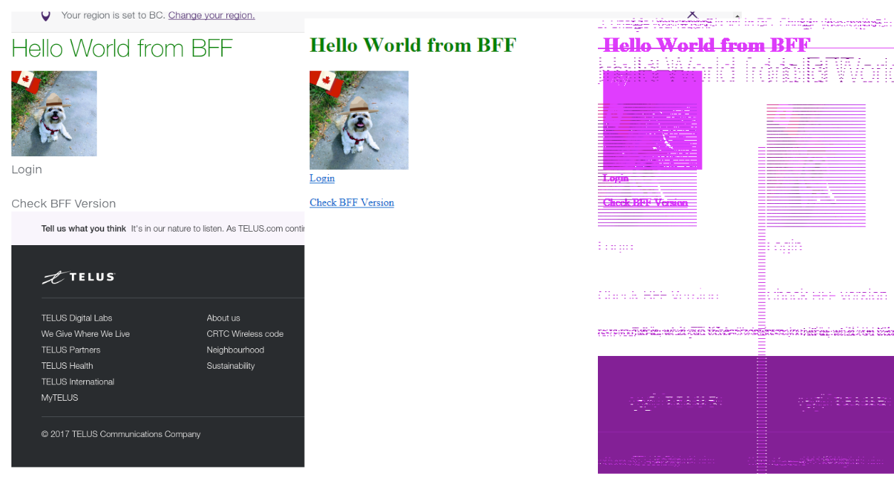

# Visual Regression Testing

## Why

We want to ensure that there are no unexpected look and feel changes, when we deliver new versions of our application.

## What

Use [node-resemble-js](https://www.npmjs.com/package/node-resemble-js) to perform a visual diff of our pages, during our [end to end](e2e.md) tests.

## How

In our [isomorphic starter kit][starter-kit], we created a [`nightwatch`][nightwatch] custom assertion library that runs in the [e2e](e2e.md) testing phase.

When you run the assertion for the first time, it will generate and store new baseline screenshots for your tests.

While these baseline screenshots are created automatically, **they will have to be manually committed to your git repo**. This is considered best practice to ensure code changes and baseline screenshots are versioned side-by-side.

On subsequent executions, new screenshots will be made and compared with the baseline. If there is a difference greater than the specified threshold, the tests will fail and abort the delivery pipeline. If the change is desirable, you simply need to update the baseline screenshots with new versions to allow subsequent success of the pipeline.

### Threshold 

the threshold value is customizable, a recommended & default value of `5%` is usd in the starter kit to accommodate for slight differences in fonts, etc...

The visual diff will mark the problem areas with a purple overlay:

## Who

- @design: Baseline Images
- @delivery @qa @developers: tooling & automation

## References

- [node-resemble-js](https://www.npmjs.com/package/node-resemble-js)